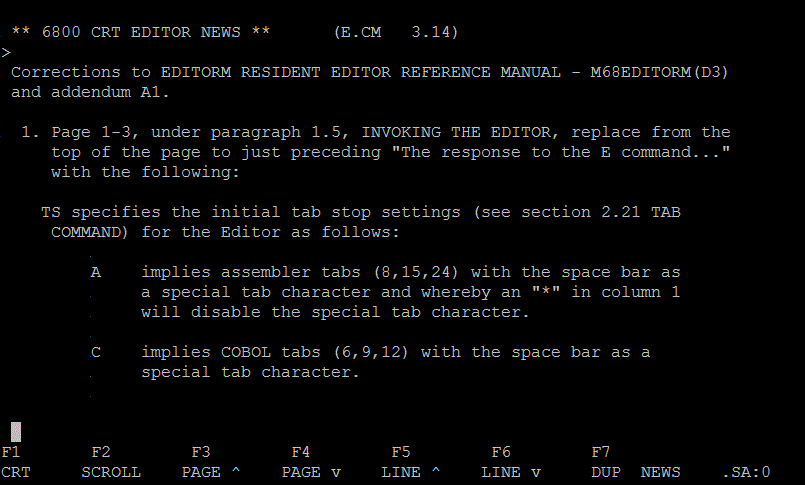

<h2>Introduction to MDOS</h2>

<h3>This is one way to write an assembly language "Hello, World!" program:</h3>

1. Use EDITM to create the assembly language source file:

<pre style="font-family: Andale Mono, Lucida Console, Monaco, fixed,
monospace; color: #000000; background-color: #eee;font-size: 12px;border:
1px dashed #999999;line-height: 14px;padding: 5px; overflow: auto; width:
100%"><code>=<b>EDITM</b>
EDITM RELEASE 3.10
COPYRIGHT BY MOTOROLA 1978
READY
?<b>BUILD HELLO</b>
HELLO   .SA:0 CREATED
0010 <b> NAM HELLO</b>         <i>Sets module name</i>
0020  <b>TTL HELLO</b>         <i>Sets title on listing</i>
0030  <b>OPT REL,G,S</b>       <i>options: rel for relocatable, g to expand fcc</i>
0040  <b>PSCT</b>              <i>Program section</i>
0050 <b>START LDX #PROMPT</b>  <i>Point to string</i>
0060  <b>SCALL .DSPLY</b>      <i>Display string</i>
0070  <b>SCALL .MDENT</b>      <i>Return to MDOS</i>
0080 <b>PROMPT FCC &quot;HELLO, WORLD!&quot;</b>
0090  <b>FCB 13</b>            <i>Carriage return terminates string</i>
0100  <b>BSZ 80</b>            <i>Allocate space for stack</i>
0110  <b>END START</b>         <i>Label after END is entry point</i>
0120   
?<b>RESE N</b>                 <i>Eliminate line numbers</i>
READY
?<b>LIST</b>
 NAM HELLO
 TTL HELLO
 OPT REL,G
 PSCT
START LDX #PROMPT
 SCALL .DSPLY    
 SCALL .MDENT
PROMPT FCC &quot;HELLO, WORLD!&quot;
 FCB 13   
 BSZ 80   
 END START
?<b>Q</b>
SAVE IN HELLO1  .SA:0 (Y/N)?<b>Y</b>
READY
?<b>Q</b>
=</code></pre>

2. Assemble, including EQU.SA file.  Note that there is no
<code>include</code> directive, so header files like EQU.SA have to be
specified on the command line.

<pre style="font-family: Andale Mono, Lucida Console, Monaco, fixed,
monospace; color: #000000; background-color: #eee;font-size: 12px;border:
1px dashed #999999;line-height: 14px;padding: 5px; overflow: auto; width:
100%"><code>=<b>RASM EQU,HELLO1;LO=HELLO1</b>
<i>...490 lines from the EQU.SA file...</i>
00491                         NAM    HELLO
00492                         TTL    HELLO
00493                         OPT    REL,G
00494P 0000                   PSCT
00495P 0000 CE 0007  P START  LDX    #PROMPT
00496P 0003                   SCALL  .DSPLY
00497P 0005                   SCALL  .MDENT
00498P 0007    48    A PROMPT FCC    "HELLO, WORLD!"
     P 0008    45    A
     P 0009    4C    A
     P 000A    4C    A
     P 000B    4F    A
     P 000C    2C    A
     P 000D    20    A
     P 000E    57    A
     P 000F    4F    A
     P 0010    52    A
     P 0011    4C    A
     P 0012    44    A
     P 0013    21    A
00499P 0014    0D    A        FCB    13
00500P 0015    0050  A        BSZ    80
00501          0000  P        END    START
TOTAL ERRORS 00000--00000
=</code></pre>

3. Link

<pre style="font-family: Andale Mono, Lucida Console, Monaco, fixed,
monospace; color: #000000; background-color: #eee;font-size: 12px;border:
1px dashed #999999;line-height: 14px;padding: 5px; overflow: auto; width:
100%"><code>=<b>RLOAD</b>
MDOS LINKING LOADER REV F3.P0
COPYRIGHT BY MOTOROLA 1977
?<b>IF=T</b>			<i>Gives name of temporary file for second pass</i>
?<b>BASE</b>			<i>Set base addresses for MDOS</i>
?<b>IDON</b>			<i>Enable display of module name information</i>
?<b>LOAD=HELLO</b>		<i>Load object file, first pass</i>
  HELLO   
?<b>OBJA=HELLO</b>		<i>Give name of output file, start second pass</i>
  HELLO   
?<b>MAPF</b>			<i>Show map file</i>
  NO UNDEFINED SYMBOLS
MAP
 S SIZE  STR  END COMN
 B 0000 0020 0020 0000		<i>&lt;-- Base section, for code below $100</i>
 C 0000 2000 2000 0000		<i>&lt;-- Common section</i>
 D 0000 2000 2000 0000		<i>&lt;-- Data section</i>
 P 0065 2000 2064 0000		<i>&lt;-- The code is here, in program section</i>
MODULE NAME BSCT DSCT PSCT
  HELLO     0020 2000 2000
?<b>EXIT</b>			<i>Exit RLOAD</i>
=</code></pre>

4. Load and run

<pre style="font-family: Andale Mono, Lucida Console, Monaco, fixed,
monospace; color: #000000; background-color: #eee;font-size: 12px;border:
1px dashed #999999;line-height: 14px;padding: 5px; overflow: auto; width:
100%"><code>=<b>LOAD HELLO;G</b>
HELLO, WORLD!
</code></pre>

5. Rename it to a command file

<pre style="font-family: Andale Mono, Lucida Console, Monaco, fixed,
monospace; color: #000000; background-color: #eee;font-size: 12px;border:
1px dashed #999999;line-height: 14px;padding: 5px; overflow: auto; width:
100%"><code>=NAME HELLO.LO .CM</code></pre>

6. Now just type the command:

<pre style="font-family: Andale Mono, Lucida Console, Monaco, fixed,
monospace; color: #000000; background-color: #eee;font-size: 12px;border:
1px dashed #999999;line-height: 14px;padding: 5px; overflow: auto; width:
100%"><code>=HELLO
HELLO, WORLD!
=</code></pre>

You should likely modify EQU.SA to suppress its listing.

<pre style="font-family: Andale Mono, Lucida Console, Monaco, fixed,
monospace; color: #000000; background-color: #eee;font-size: 12px;border:
1px dashed #999999;line-height: 14px;padding: 5px; overflow: auto; width:
100%"><code><i>Add:</i>
* INCLUDING MDOS EQUATE FILE
* LISTING OFF...
	OPT NOLIST	<i>At the beginning.</i>
<i>Add:</i>
	OPT LIST	<i>At the end.</i>
* ...LISTING ON
</code></pre>

<h3>Hello World with modules:</h3>

1. Create a MAIN module:

<pre style="font-family: Andale Mono, Lucida Console, Monaco, fixed,
monospace; color: #000000; background-color: #eee;font-size: 12px;border:
1px dashed #999999;line-height: 14px;padding: 5px; overflow: auto; width:
100%"><code>=EDITM
EDITM RELEASE 3.10
COPYRIGHT BY MOTOROLA 1978
READY
?<b>BUILD MAIN</b>
MAIN    .SA:0 CREATED
0010  <b>NAM MAIN</b>
0020  <b>TTL MAIN</b>
0030  <b>OPT REL</b>
0040  <b>OPT G</b>
0050  <b>OPT S</b>
0060  <b>PSCT</b>
0070  <b>XREF DOIT</b>
0080 <b>START JSR DOIT</b>
0090  <b>SCALL .MDENT</b>
0100  <b>BSZ 80</b>
0110  <b>END START</b>
0120 
?<b>RESE N</b>
READY
?<b>LIST</b>
 NAM MAIN
 TTL MAIN
 OPT REL
 OPT G
 OPT S
 PSCT
 XREF DOIT
START JSR DOIT
 SCALL .MDENT
 BSZ 80
 END START
?<b>Q</b>
SAVE IN MAIN    .SA:0 (Y/N)?<b>Y</b>
READY
?<b>Q</b>
=</code></pre>

2. Modify HELLO module so that it's a subroutine:

<pre style="font-family: Andale Mono, Lucida Console, Monaco, fixed,
monospace; color: #000000; background-color: #eee;font-size: 12px;border:
1px dashed #999999;line-height: 14px;padding: 5px; overflow: auto; width:
100%"><code>=<b>EDITM</b>
EDITM RELEASE 3.10
COPYRIGHT BY MOTOROLA 1978
READY
?<b>LOAD HELLO</b>
RESEQUENCE NEEDED
READY
?<b>RESE</b>
READY
?<b>LIST</b>
0010  NAM HELLO
0020  TTL HELLO
0030  OPT REL
0040  OPT G
0050  OPT S
0060  PSCT
0070 FRED JMP FRED
0080 START LDX #PROMPT
0090  SCALL .DSPLY
0100  SCALL .MDENT
0110 PROMPT FCC "HELLO, WORLD!"
0120  FCB 13
0130  BSZ 80
0140  END START
?<b>0100  RTS</b>
?<b>0080 DOIT LDX #PROMPT</b>
?<b>0140  END</b>
?<b>0055  XDEF DOIT</b>
?<b>LIST</b>
0010  NAM HELLO
0020  TTL HELLO
0030  OPT REL
0040  OPT G
0050  OPT S
0055  XDEF DOIT
0060  PSCT
0070 FRED JMP FRED
0080 DOIT LDX #PROMPT
0090  SCALL .DSPLY
0100  RTS
0110 PROMPT FCC "HELLO, WORLD!"
0120  FCB 13
0130  BSZ 80
0140  END
?<b>0130</b>
DELETED
?<b>RESE N</b>
READY
?<b>Q</b>
SAVE IN HELLO   .SA:0 (Y/N)?<b>Y</b>
READY
?<b>Q</b>
</code></pre>

3. Link them

<pre style="font-family: Andale Mono, Lucida Console, Monaco, fixed,
monospace; color: #000000; background-color: #eee;font-size: 12px;border:
1px dashed #999999;line-height: 14px;padding: 5px; overflow: auto; width:
100%"><code>=<b>RLOAD</b>
MDOS LINKING LOADER REV F3.P0
COPYRIGHT BY MOTOROLA 1977
?<b>IF=T</b>
?<b>BASE</b>
?<b>IDON</b>
?<b>LOAD=HELLO</b>
  HELLO   
?<b>LOAD=MAIN</b>
  MAIN    
?<b>OBJA=HELLO</b>
  HELLO   
  MAIN    
?<b>MAPF</b>
  NO UNDEFINED SYMBOLS
MAP
 S SIZE  STR  END COMN
 B 0000 0020 0020 0000
 C 0000 2000 2000 0000
 D 0000 2000 2000 0000
 P 006C 2000 206B 0000
MODULE NAME BSCT DSCT PSCT
  HELLO     0020 2000 2000
  MAIN      0020 2000 2017
DEFINED SYMBOLS
 NAME  S  STR  NAME  S  STR  NAME  S  STR  NAME  S  STR  NAME  S  STR 
DOIT   P 2003 
?<b>EXIT</b>
=</code></pre>

4. Try it

<pre style="font-family: Andale Mono, Lucida Console, Monaco, fixed,
monospace; color: #000000; background-color: #eee;font-size: 12px;border:
1px dashed #999999;line-height: 14px;padding: 5px; overflow: auto; width:
100%"><code>=<b>LOAD HELLO;G</b>
HELLO, WORLD!
=</code></pre>

I think the start addess is the label on END of the last module.  I don't
think this label can refer to an XREF- it's got to be in the module.

<h1>MDOS EDITORS</h1>

There are three:

<h3>EDIT</h3>

Invoke as follows: <code>EDIT input-file,output-file</code>

This is a much simplified <a
href="http://en.wikipedia.org/wiki/Text_Editor_and_Corrector">TECO</a>
clone.  TECO is like a screen editor, but without the screen.  Instead you
have to use your imagination to remember where the cursor is.

An important concept to understand for TECO-like editors is that they
allow you to edit large files, but only within a small in-memory buffer
window at a time, and without any kind of software or hardware based virtual
memory system.  The window makes one pass through the file, then you must
exit and re-enter the editor.

Two commands facilitate this.  Use A to append 255 lines from the
beginning of the input file into the buffer.  When you are done editing use
P to move lines from the buffer to the output file.  Now that there is space
free for more lines, you can use the A command again to get more lines.

The P command allows you to move lines from any part of the edit buffer
to the output file.  This can sometimes be useful as a kind of cut and paste
feature, but usually you will want to append lines between the cursor and
the beginning of the buffer to the end of the output file, so you need to
use something like -500P$$ (copy lines starting 500 lines back to the cursor
and append to output file).

<h4>EDIT commands:</h4>

$ means hit ESC key.  It is possible to give several commands before
hitting the final ESC.

<dl>
<dt>[-]nnP$$<dd>Remove lines from the buffer and append them to the output file.
<dt>A$$<dd>Bring in 255 lines from the file and append them to the buffer (you need to do this before you can do any editing).
<dt>I<i>text</i>$$<dd>Insert text at current position.
<dt>E$$<dd>Move remaining lines from buffer and input file to output file and exit.
<dt>[-]nnM$$<dd>Move forward by nn characters
<dt>[-]nnD$$<dd>Delete characters
<dt>N<i>text</i>$$<dd>Search forward for text.  This command automatically
runs the A and P commands to bring more text into the editor until the
string is found.  If the search fails, you need to exit the editor because
all of the text will have been written out.
<dt>B$$<dd>Go to beginning of buffer
<dt>Z$4<dd>Go to end of buffer
<dt>K$$<dd>Delete to end of current line including CR
<dt>-T$$<dd>Type from beginning of previous line to current position
<dt>-1T$$<dd>Type from beginning of previous line to current position
<dt>T$$<dd>Type to end of current line
<dt>1T$$<dd>Type to end of current line
<dt>0T$$<dd>Type from beginning of current line to cursor
<dt>0TT$$<dd>Type entire current line
<dt>S<i>text</i>$$<dd>Search forward for text.  If not found, leave cursor
at same position.
<dt>C<i>text</i>$<i>replace</i>$<dd>Search forward for string and replace it.
<dt>C<i>text</i>$$<dd>Search forward for string and delete it.
<dt>[-]nnL$$<dd>Move cursor forward [-]nn lines
</dl>

One way to use EDIT defensively is to try to always keep the cursor at
the beginning of the line.  In this way, it is somewhat like a line editor,
which at least requires a little less imagination to use without getting
hopelessly lost.

<dl>
<dt>A$$<dd>Bring file in from disk
<dt>T$$<dd>Show current line
<dt>L$$<dd>Move to beginning of next line
<dt>-L$$<dd>Move to beginning of previous line
<dt>K$$<dd>Delete current line
<dt>I<i>text </i>$$<dd>Insert line - remember to include carriage return.
<dt>E$$<dd>Save and exit
<dt>S<i>text</i>$$L-L$$<dd>Find text and move to beginning of line
<dt>C<i>text</i>$<i>repl</i>$$L-L$$<dd>Change text in current line and go
back to beginning of line
<dt>L-L$$<dd>Go to beginning of line
<dt>L-M$$<dd>Go to end of line
</dl>

Note: there is no "repeat previous search" that I could find.

Note: there is no way to abort your current edits (so make a backup file
first)

<h3>E (EDITORM RESIDENT EDITOR)</h3>

This is a screen editor (for an ExorTERM 155) with a line editor mode. 
This was the only editor I used when I used MDOS professionally.  I only
used it in line mode ("scroll mode"), because we did not have an ExorTERM
155.  Also, I think the version I used had been patched to always start in
scroll mode.

Invoke the editor with: <code>E FILENAME;S-N</code>

Option <b>S</b> disables screen editor mode ("crt" mode).  Option
<b>-N</b> disables automatic line numbering of new files.</b>

If someone knows the control sequences for an ExorTERM 155, please send
them to me.  I'll add a translater to EXORSIM so that E can be used as a
screen editor with ANSI terminal emulators.

<b>Update!</b> I have found the manual for the EXORterm 155 and have
implemented an emulator for it so that now E can run in screen editor mode. 
Check it out:

In this mode, E is a modal editor like vi.  You type commands (see the
list below) into a prompt.  You move the "current line" pointer using the
arrow keys, scrolling keys (F3 - F6) or by executing one of the commands. 
If you type the insert command, the cursor jumps into the text at the
current line.  When you are done inserting new lines, hit F1 to get back
to the command prompt.

At any time you can switch between scroll mode or crt mode by hitting F2
or F1.

<h4>E Editor commands:</h4>

These strings are in the commnad table: <code>C, CHAN, D, DEL, DELE, DUPL, E,
EX, EXTE, F, FIND, I, INSE, L, LIST, MERG, MOVE, N, NUMB,
PRIN, QUIT, R, RANG, RESE, S, SAVE, SEAR, TAB, V, VERI, X, XTRA.</code>

<dl>
<dt>F<dd>Go to top of file
<dt>F -1<dd>Go back one line
<dt>F 1<dd>Go forward one line
<dt>F /<i>string</i>/<dd>Search for <i>string</i> starting at beginning of file
<dt>S /<i>string</i>/<dd>Search for <i>string</i> starting at next line
<dt>S<dd>Find next instance
<dt>C /<i>old</i>/<i>new</i>/<dd>Replace old string with new one in current line
<dt>L<dd>List entire file
<dt>L [-]NN<dd>List one line relative to current line
<dt>L [-]NN-MM<dd>List MM lines starting with line [-]NN relative to current
line
<dt>QUIT<dd>Save and exit
<dt>QUIT A<dd>Abandon and exit
<dt>SAVE<dd>Save file
<dt>DEL<dd>Delete current line
<dt>DEL [-]NN<dd>Delete line [-]NN, relative to current line
<dt>DEL [-]NN-MM<dd>Delete range of lines
<dt>MOVE [-]NN-MM<dd>Cut
<dt>XTRA<dd>Paste
<dt>EX /<i>string</i>/<dd>Append <i>string</i> to current line
<dt>RESE<dd>Add line numbers, resequence
<dt>RESE N<dd>Eliminate line numbers
<dt>MERG <i>name</i><dd>Insert file
<dt>I<dd>Enter insert mode: Insert lines until you try to enter a blank
line (in scroll mode) or hit F1 (in crt mode).
</dl>
<h3>EDITM</h3>

This is a "simple" line editor which requires you to use line numbers (because it
has no notion of current line).  Since no programming languages except BASIC
expect line numbers, you have to "rese n" (delete them) before saving the
file.

Documentation for this editor is incuded on some of the MDOS disk images
on bitsavers.

<h4>EDITM commands:</h4>

<dl>

<dt>BUILD &lt;file&gt;<dd>Create a new file
<dt>LOAD &lt;file&gt; [N]<dd>Load a file.  N means no. line no.s in file.
<dt>LIST [NN[-MM]]<dd>List a file.  9999 means list name too.
<dt>SAVE &lt;file&gt;<dd>Save file
<dt>NNN &lt;line&gt;<dd>Add a line
<dt>NNN<dd>Modify a line
<dt>END,Q,QUIT,EXIT<dd>Exit editor.  Prompts for name.
<dt>C /XXX/YYY/<dd>Change
<dt>C NN/XXX/YYY/<dd>
<dt>C NN-MM/XXX/YYY/<dd>
<dt>C NN-MM;KK/XXX/YYY/<dd>KK is occurance.  'A' means all.  <b>_</b> in XXX or YYY is single character wild
card.
<dt>A /XXX/<dd>Append
<dt>A NN/XXX/<dd>
<dt>A NN-MM/XXX/<dd>
<dt>F /XXX/<dd>Find
<dt>F NN/XXX/<dd>
<dt>F NN-MM/XXX/<dd>
<dt>F NN-MM;KK/XXX/<dd>
<dt>P<dd>List to printer
<dt>P NN<dd>
<dt>P NN-MM<dd>
<dt>RSQ<dd>Resequence
<dt>RESE<dd>Resequence
<dt>RSQ MM<dd>MM is starting
<dt>RSQ MM,NN<dd>NN is increment
<dt>RSQ NLN<dd>			Remove record keys
<dt>M NN,MM<dd>Move
<dt>M NN-MM,LL<dd>
<dt>M NN-MM,LL,KK<dd>LL is new location, KK is new increment (def = 1)
<dt>DEL NN<dd>Delete
<dt>DEL NN-MM<dd>
<dt>D NN,MM<dd>Duplicate
<dt>D NN-MM,LL<dd>LL is new location, KK is new increment
<dt>D NN-MM,LL,KK<dd>
<dt>B<dd>Block mode (narrow to last range)
<dt>B OFF<dd>
<dt>MERGE file(nn-mm),ll<dd>Merge file in.
</dl>

