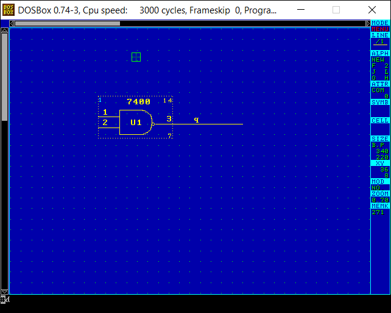
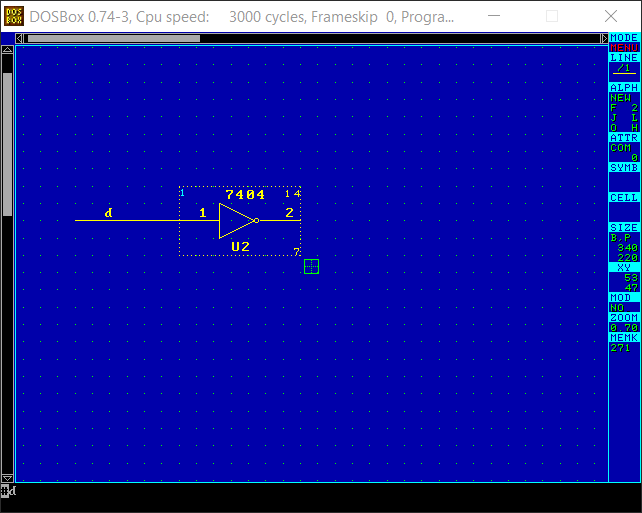

# FutureNet Dash

I had heard of FutureNet Dash, but had never used it.  It is the first
schematic capture program usable for designing Xilinx FPGAs and maybe the
first schematic capture program available for IBM PCs.  Recently I
discovered that a version is available online, but no manuals.  These are my
notes from learning to use this $3850 (1988) program.

Why even look at such an old program?  Well the user interface of these
pre-Windows programs is always interesting to explore.  I'm familiar with
"Old DOS OrCAD"- it still has an active community and competes well even
with modern ECAD programs.  OrCAD was the lower cost option for schematic
cature, so I'm curious what the high-end tool was like.

## Available information

Michael Holley wrote this about FutureNet (extracted from the Wayback
Machine):

[FutureNet_Artifacts.pdf](doc/FutureNet_Artifacts.pdf)

And contributed this some brochures and a price-list to bitsavers, here:

[http://www.bitsavers.org/pdf/futureNet](http://www.bitsavers.org/pdf/futureNet)

Some ASICs used in the Atari ST were designed in FutureNet, see here:

[https://www.chzsoft.de/asic-web/](https://www.chzsoft.de/asic-web/)

"FutureNet DASH was a schematic capture program written for IBM DOS PCs
released in the early 1980s.  It was an extremely expensive package - over
$5000 at the time.  After passing through various hands the software was
released as version 6.10 in a de-restricted version."

This is from Contrelec, which hosts this final version:

[http://www.contrelec.co.uk/pages/dashcon](http://www.contrelec.co.uk/pages/dashcon)

There is a review of it in the October 1983 issue of PC Magazine.  This
article mentions some old "mainframe" electronic design pacakges I will have
to look into at some point:

[PC Magazine Review](https://books.google.com/books?id=qURs4j9vKn4C&pg=PA532&lpg=PA532&dq=futurenet+dash+review+pc+magazine&source=bl&ots=ZL4rZR97KA&sig=ACfU3U2lhqr6opEOlPX2aa_zcWXXt0bmBg&hl=en&sa=X&ved=2ahUKEwjYx6bGpePvAhXpdN8KHX9rApoQ6AEwCHoECAEQAw#v=onepage&q=futurenet%20dash%20review%20pc%20magazine&f=false)

There is no further documentation that I can find.  However, the program has
on-line help.  I've extracted it here:

[Online Help](doc/dash-online-help.md)

The commands are organized by function by prefix:

	. commands are for symbols / parts
	/ commands are for wires
	# commands are for hierarchy
	[ commands are for area cut and paste
	' commands are for text
	Commands with no prefix are for everything else, such as file operations.

## Using the program

You need to set up the environment.  It's a good idea to create a batch file
for this:

    SET FNMOUSE=M
    SET FNDISPLAY=C:\DATAIO\FN\VGA12.DG
    SET FNLIB=C:\DATAIO\FNLIB
    SET FNLOG=FNLOG.CMD
    SET FNELOG=FNERR.LOG
    SET FNPRO=FNPRO.CMD
    path=c:\dataio\fn;%path%

Then type "fn" or "dash" to start the program.

These macros are assigned to function keys, so they are probably important:

    F1	HELP
    F2	QUIT
    F3	'P
    F4	'L
    F5	/D	Draw or delete a junction
    F6	/ES	Delete line segment
    F7	/P
    F8	/ET	Erase temporary lines?
    F9	'0
    F10	/0	Cycle through line styles

### Display Drivers

Sadly, I can only get it work in 640x480 mode with the VGA12.DG driver in
DOSBOX.  The release notes mention higher resolution modes, but I think
either the driver is missing or I'm missing information on how to select
them.

OrCAD has a huge advantage here- the display driver architecture is
documented and assembly language source code examples are provided.  People
have made drivers that work on recent video cards (it works well in DOSBOX)
and have even created a GDI driver that allows you to have a resizable
window up to the size of any modern display supported by Windows.  OrCAD is
still a DOS program, so only 32-bit versions of Windows will run it.  The
lack of virtual-8086 support from 64-bit mode processors has forced OrCAD
users to turn to DOSBOX.  Unfortunately this is step back compared with how
it worked with the GDI driver.

### Commands

Normally you are in "graphic editing" mode.  From this mode, you can type
commands.  Note however that if you hit Esc, you enter "alphanumeric"
mode.  Hit Esc again to return to graphic editing mode.

From graphic editing mode you may type in a command.  When you press Enter,
the command may prompt you for futher missing information.  Once all
information is provided and you hit Enter, the command executes.

Interestingly, the command line doesn't clear after you hit Enter- instead
the last command line is retained so that you may hit Enter again to repeat
the command.  Only when you start typing a new command does the line clear.

You can actually enter a small script at the command line: multiple commands
may be entered, separated by semicolons.  Again it is retained, so hitting
Enter repeats the script.

Scripts may be bound to keys with the KEY command.  You can execute scripts
saved in files with the AUTO and EXEC commands.

By contrast, OrCAD does not have a command line, instead there is a
keystroke-based menu system: You hit 'P' for the placement menu, and then
'T' to place text.  You can hit 'R' to repeat the previous single command. 
There are keyboard macros and you can start recording with the 'M' command
and then by selecting which key you want the macro to be bound to.  There is
also a text form of these macros which can be bound to keys in a setup file. 
There is no way to execute a script file, but in one way OrCAD macros are
more powerful: you can hit Ctrl-Home during recording at any point requiring
user input.  FutureNet has no such feature, but will automatically assume
"Yes" to any Yes/No questions that commands may have.

### The cursor and panning

You can move the cursor with the mouse, but also with the keyboard.  Arrow
keys will move the cursor, as well the "left", "right", "up" and "down"
commands.

You can enter a repeat prefix before hitting an arrow key.  For example, 5
then right-arrow moves 5 positions to the right.  The prefix is retained for
additional arrow key presses.

The repeat prefix does not seem to work as a command: you can not say
"5;right" for example.

The displayed screen is a small window onto the larger schematic sheet.  As
with OrCAD, FutureNet uses auto-panning.  It means that if you hit the edge
of the screen with the cursor, the screen automatically pans in the given
direction to view more of the sheet.  FutureNet displays scrollbars, but
there is no reason to use them.

It's difficult to convey just how much more conventient and quick this is to
use vs.  scroll bars, though I think it works better in OrCAD somehow-
sometimes FutureNet doesn't detect the pan request.

### Grid

There are commands to control the displayed grid:

    grid        - Turn the grid on or off
    grid snap   - Turn snap-to-grid on or off

I've found that you probably do not want snap-to-grid on.  Many symbols have
pins which are not aligned with the displayed grid.  Also the native grid is
not much finer than the displayed grid, so you don't really need it.

In OrCAD you always want snap to grid, since the native grid is one pixel.

Having all key symbol points on a grid is very important for keyboard
acceleration.  You can make commands (or macros in OrCAD) to lay down a
series of wires or labels in a structured way.  This is basically impossible
to do without a grid.

### Selecting the sheet size

There is a command:

    size a     Select A size sheet

The default size is b.

An annoying limitation is that you can not reduce the size of a non-empty drawing.

### Menus

When you are in no other mode, right click to bring up menus of all
available commands.  I suspect this was added in later versions to keep up
with GUI fads.

### Zooming

Hit PgUp and PgDn to jump between different magnifications.  You can also
use the "zoom" command for custom ones.

Zooming works fairly well in that a correctly scaled font is chosen for the
zoom level.  Well at least two of the prefined magnifications have legible
text.  OrCAD had only a single text-legible zoom level.

### Adding a part

    * <Part number> <Enter>
    .L <Part number> <Enter>
    * <Enter>                  - It will prompt for the part number
    .L <Enter>                 - It will prompt for the part number

Single device per package parts are named as you would expect, for example
use 8088 for an 8088 microprocessor.  But for a TTL inverter, you need to
use "7404A" to get the first one of the package, or "7404B" for the second
one, etc.

OrCAD has the "G" (get part) command for this.  You can type in the part, or
scroll through a text-only list of them.

### Moving a part

Left-click in the center of the part and it should enter move part mode.

Also you can type . M \<Enter>

### Rotating / Mirroring part

There are a number of commands for this:

    .R	Rotate part
    .RE	Reflect part

You may enter these command while a part is already attached to the cursor
for moving.

### Duplicating a part

Position mouse over part and enter . C \<Enter>.  A copy of the part will be
attached to the mouse.

### Deleting a part

Position mouse over part and enter . E \<Enter>.

### View a list of available parts

Type .DIR \<Enter>

A window with a list of symbol libraries along with a list of symbols and a preview
pops up.

OrCAD also has a part browser with preview, but you have to step through
parts one at a time.  FutureNet's browser is definitely better.

### Load a symbol library

You need to do this to make the symbols in a library available to you.

Type .LIB \<Enter>

You will be prompted for the name of the library.  You can enter a complete
path, such as C:\\DATAIO\\FNLIB\\GENERIC.LIB.

### Some important parts

These are in SYSTEM.LIB, which seems to be loaded by default:

TBLOCKA, TBLOCKB, TBLOCKC, TBLOCKD, and TITL are title blocks.

TX1, TX2, TX3 are transformers.

SWNC, SWNO are switches.

RES is a resistor.

POT is a potentiometer.

PCAP is a polarized capacitor.

CON1, CON3, CON4, etc. are generic connectors.

DIODE is a diode.

JUMPER is a jumper

These are in GENERIC.LIB:

BULLETIO   I/O port (inter-sheet connector?)

BULLETR  (inter-sheet connector?)

CONnn  Generic connectors

EGND   Normal earth ground

GND1, GND2, GND3.. other grounds

E4  power?

### Drawing wires

Postion the mouse over a pin (valid pins are highlighted when you hover over
them) and left-click (no need to hold) to start drawing.  As you move the
mouse, the potential line segment is shown as a dashed red line.  Left-click
again to solidify the segment and start a new one from the current position. 
To stop drawing, right-click the mouse.

Do not hit ESC to complete drawing- it switches to text mode.  If you do
this, hit ESC again to return to graphics mode.

You can also type / L \<Enter> to start drawing a wire- I'm not sure why
they have this since you can just left-click.

### Connecting wires

Use / d \<Enter> or hit F5 to draw or delete a junction dot.

### Deleting wires

Position mouse on wire, then hit F6 or type / E S \<Enter>.

### Place a label on a wire

FutureNet calls all text "Alphanumeric Fields".  What the text actually does
depends on where it is located and what its "attribute" is.  I think we
would call attributes types today.  Attributes are mostly predefined (but there
are also user defined attributes), and are numbered and named.

First, decide on the purpose of the text.  For a label on a wire, we want a
"SIG"- a Signal, which is attribute number 5.  So enter the command to
select this attribute:

    'a sig <Enter>       - Choose attribute by name
    'a 5 <Enter>         - Choose attribute by number
    'a <Enter>           - Brings up a menu of attributes

From now on any new "Alphanumeric Fields" we enter will be signals.  In the
rather likely event that you forgot to select the correct attribute type,
you can change the attribute of existing text like this:

    'ch a sig <Enter>    - Change attribute of text under mouse to SIG

Now to actually write some text, position mouse on a wire and hit ESC.  This
switches to text mode and you can type the label.  The "Point of Effect" (as
FutureNet calls it) must be on the wire.  When you are done typing, don't
hit \<Enter>.  Instead hit ESC again to return to graphics mode.

### Reveal Codes

There is a command 'd that reveals the attribute codes (somewhat like
WordPerfect's "reveal codes")- all of the text is replaced is replaced by
the attribute code assigned to it.

Here is sheet with a number of different types of alphanumeric fields:

After hitting 'd:

### Delete a label

Position mouse on label and type

    'E <Enter>

### Attributes

Number  |Name           |Description
--------|---------------|------------
0	|COM		|Comment?
1	|PIN		|"40" pin number
2	|LOC		|"UNNN" reference designator
3	|PART		|"8088"
5	|SIG		|Signal (wire label)
20	|PINT		|"26" Tristate pin
22	|PNBT		|"9" Bidirectional pin
23	|PINI		|"33" Input pin
24	|PINO		|"24" Output pin
50	|TITL		|Title in title block
51	|DNUM		|"000000" Drawing number in title block
52	|DREV		|"A" Rev number in title block
53	|DPAG		|"1 OF 1" in title block
54	|DATE		|"July 26, 1991" Date in title block
100	|GND		|Auto-connect to power net (shows in lower right corner of 7404 symbol)
101	|+5V		|Auto-connect to power net (shows in upper right corner of 7404 symbol)

### Connect to a power rail

OrCAD has a special power symbol and you give the name of the rail as the
part value.  FutureNet works differently: you label a wire with the name of
the power rail and set the attribute of the label to "PWRS" (for "Named
Power Signal").

It is common to have hidden and automatically connected power pins on 74xx
series TTL gates.  The symbols for such gates include pin numbers as two
text fields (often pins 14 and 7).  The attributes for these fields are
"GND" (attribute 100) and "+5V" (attribute 101).

Questions: Are all attributes above 100 global?  How do you have a hidden
+3.3V rail?

### Hierarchical designs

Create a symbol for a subsheet by creating a "functional block".  Use the .F
command to create it.  Within the functional block symbol, place an
"alphanumeric field" containing the file name of the sub-sheet, with its
attribute set to FILE (attribute number 8).

Point to the file name and issue the "#D" command (down hierarchy) to
descend into it.  You can issue the "#U" command (up hierarhcy) to return to
the previous level.  The first time you descend into a file FutureNet will
indicate that it is new and ask if it should be created.

The functional block should include pins for the signals that are to be
brought up from the subsheet.  Create them with ".-".  The pins should be
labeled with text that has one of the pin attributes: PINI (for inputs),
PINO (for outputs), PNBT (for bidirectional), etc.

The subsheet itself should have a wire labeled with text matching the pin. 
"SIG" works as the attribute for the text (and I suspect other attributes
will also work).

OrCAD has dedicated module port symbols this.

The netlist ends up like this.  'q' and 'd' are gone, but the part are
connected together with the top-level net 'mysig'.

~~~~
NETLIST,2
(DRAWING,\TRYNET\TOP.DWG,1-1
)
(DRAWING,\TRYNET\SOURCE.DWG,2-1
PATH,\TRYNET\TOP.DWG,1,
)
(DRAWING,\TRYNET\DEST.DWG,3-1
PATH,\TRYNET\TOP.DWG,2,
)
(SYM,2-1,1
DATA,2,U1
DATA,3,7400
DATA,23,1
DATA,23,2
DATA,21,3
DATA,100,7
DATA,101,14
)
(SYM,3-1,1
DATA,2,U2
DATA,3,7404
DATA,23,1
DATA,21,2
DATA,100,7
DATA,101,14
)
(SIG,,,,,
PIN,2-1,1,U1,23,1
PIN,2-1,1,U1,23,2
PIN,3-1,1,U2,21,2
)
(SIG,,+5V,,,
PIN,2-1,1,U1,101,14
PIN,3-1,1,U2,101,14
)
(SIG,,GND,,,
PIN,2-1,1,U1,100,7
PIN,3-1,1,U2,100,7
)
(SIG,,mysig,1,5,mysig
PIN,2-1,1,U1,21,3
PIN,3-1,1,U2,23,1
)
~~~~

### Flat designs

A single functional block can be made of multiple sheets, so one way is to
create a top-level sheet with a single functional block (create with .F) in
it.  Within the functional block symbol, place multiple "alphanumeric
fields" containing the file names of the sub-sheets, each with their
attribute set to FILE (attribute number 8).

Point to the first of these and type "#D" to descend hierarchy.  You can hit
"#U" to return to the top-level.  The first time you descend into each file
FutureNet will indicate that it is new and ask if it should be created.

When you are in one of the subsheets, you can traverse between its siblings
with the #R and #L commands.

Another way is to feed a list of top-level sheets to DCM.EXE when you build
the netlist.  You will not be able to use the #R and #L commands to traverse
between sheets this way.

Either way, all of the sibling sheets share the same namespace for signals-
two wires labeled with the same signal name will be connected.

In OrCAD, you can supply an aligned vertical list of file names in a
top-level sheel (not as part of a module symbol).  Very old versions of
OrCAD also supported having a list of file names in a text file, but this
feature was deprecated.

### How do you annotate?

OrCAD has an automatic annotation process to replace the default reference
designators (such as U?  in OrCAD or UNNN in FutureNet) with unique numbers
(U1, U2, etc.).  I have found no such thing in FutureNet.  It seems you have
to set them by hand.

I must be missing something here.

### How do you generate the netlist?

The sequence of commands is as follows:

First you preprocess the .DWG files into a single .DCM file with:

    DCM -itop -lfirst+second -oout

The commnd line length is very limited in MS-DOS, so you may also provide
all of the names in a text command file (this mimics the MS-DOS LINK
command).  In this case you invoke DCM like this:

    DCM @list

The command file, list.cmd should look like this:

    -itop
    -lfirst
    second
    -oout

Next you convert the .DCM file into a .NET file with:

    NETC out

You may convert the .NET file into a PADS ASCII file with:

    NET2PADS     (it prompts for the name of the .NET file)

### How do you create new parts?

### How do busses work?

I see them named like this; QB\<7:0>

Bus breakout wires are labeled 0, 1, 2, etc.

Can you have multiple labels on the same wire?  There are multiple busses on
the same sheet, and the wires for each of them will be labeled 0, 1, 2, etc.

Symbol types:

block symbol

.F create functional block

ALso, .G toggle between graphic symbol (for comments only), and circuit
symbol (electrically significant)

"alphanumeric fields" have attribute numbers
