# Xilinx Vivado setup for source control

Here is one way to structure your FPGA project so that it is compatible with
both Xilinx Vivado GUI in project mode and version control.  This setup
allows you to check in the minimum number of files needed so that you can
easily recreate the project in another workspace.

It's possible to script the entire FPGA build process, but it is also
important to be able to use project mode to access the Vivado GUI for such
tasks as debugging with the integrated logic analyzer and pin-planning.

If your setup is incorrect, you waste a lot of time fixing it, or check in
too many files.  Unfortunately, Vivado really would like your source code to
be in the project directory, so you have to actively fight it to prevent
this.

The directory structure should be this:

    example_fpga/
        rebuild.tcl   - TCL script created by Vivado.  Checked in.
        rtl/          - Your Verilog (or VHDL) source code.  All checked in.
        cons/         - Your constraint files.  All checked in.
        project_1/    - Vivado project.  Nothing here is checked in.
        ip/           - Xilinx IP.  Some files checked in.

The idea is to have the minimal set of files checked in so that you get the
Vivado project back after a fresh clone.  You should only have to type these
commands:

    git clone https://github.com/jhallen/example_fpga.git
    cd example_fpga
    vivado -source rebuild.tcl &

Also, you can always delete project_1/ and rebuild it:

    rm -rf project_1
    vivado -source rebuild.tcl &

The ip/ directly gets polluted with derived files, but at least Vivado tells
you which ones need to be saved in source control. 

# Initial project build

Suppose you don't have the project_1/ and rebuild.tcl script.  This is how
to create them.

Start Vivado.  Change directory to example_fpga first. [There are other
possibilities here, but this will get you started.]

    cd example_fpga
    vivado &

Go through the usual sequence of creating a project, but not check any of
the boxes that say "copy into project":

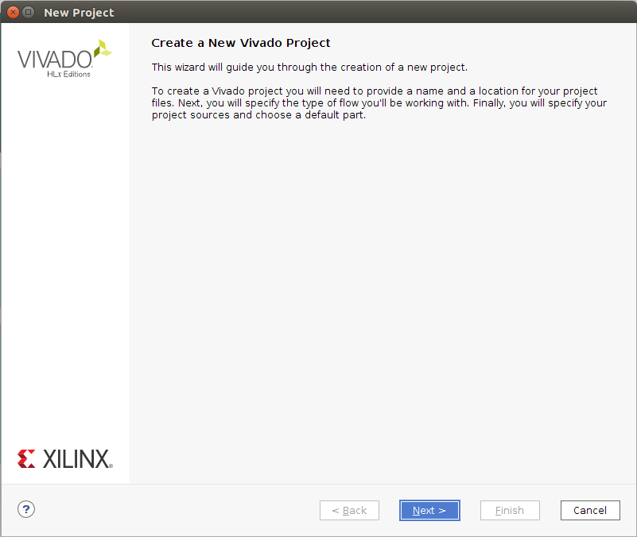
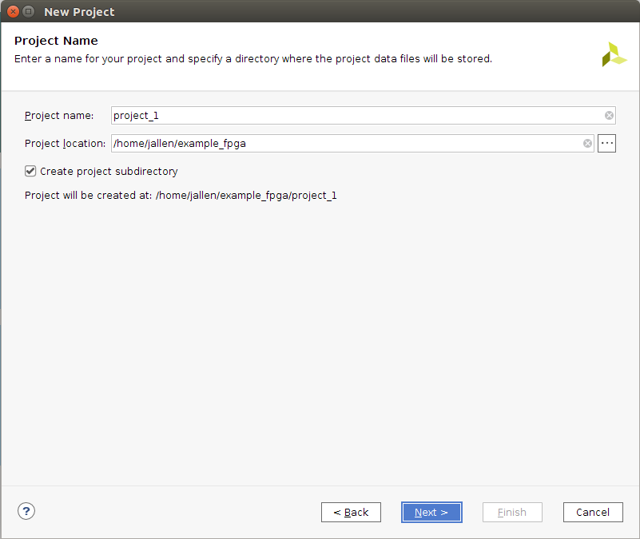
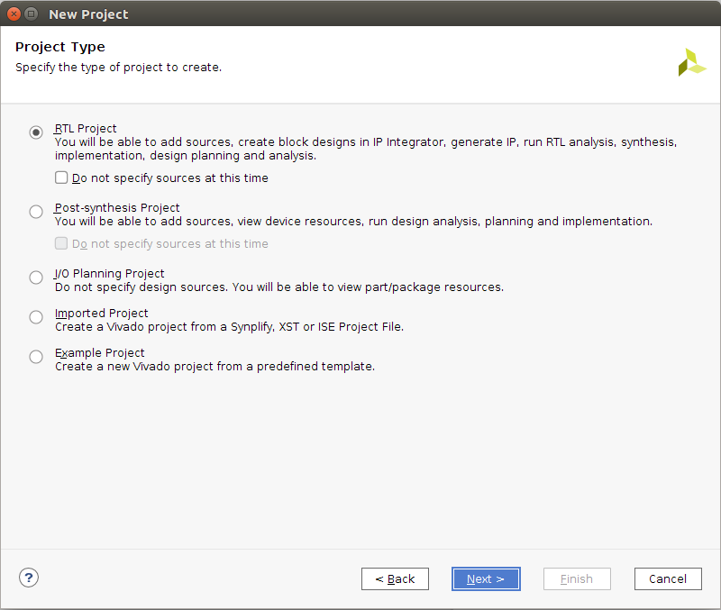

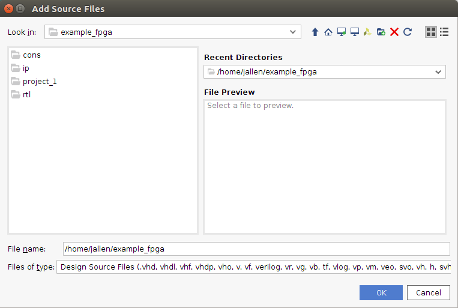
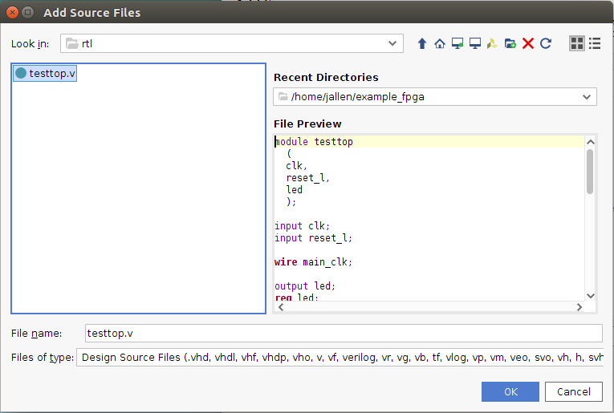

Do not check the box here:

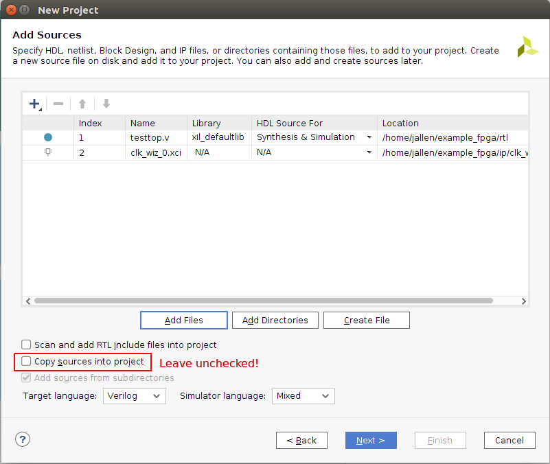

Don't check it here either!

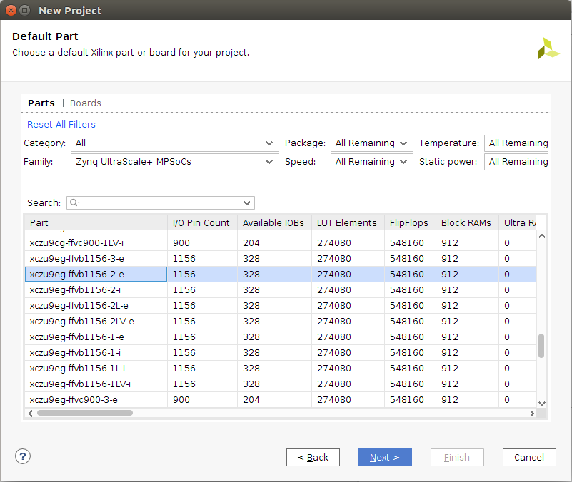

Then we wait a long time, why is Vivado so slow?

Now finally the project appears:

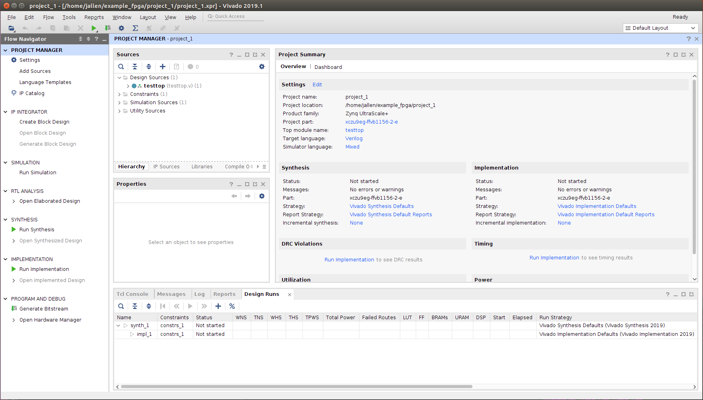

# Save the script

Use the write_project_tcl command to save the script:

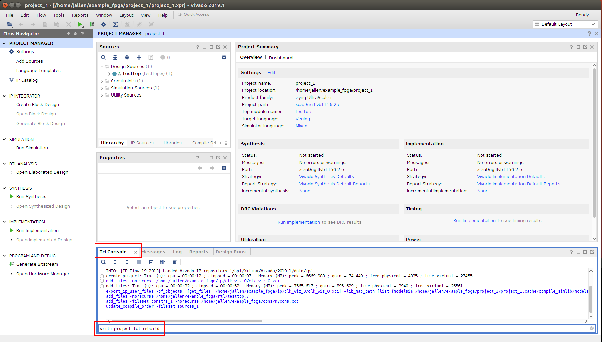

Here are the messages this command prints:

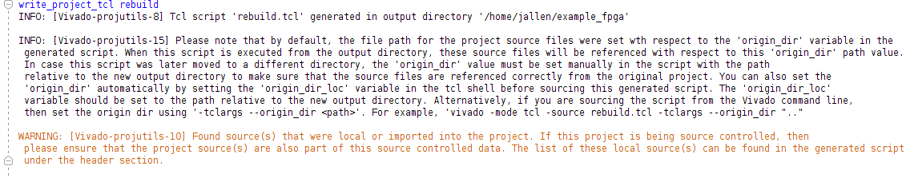

That's it.  Now you can regenerate the project with:

    rm -rf project_1
    vivado -source rebuild.tcl &

Note that the rebuild.tcl script shows you the files that need to be saved
in source control in comments.  This is in the file:

    # 3. The following remote source files that were added to the original project:-
    #
    #    "/home/jallen/example_fpga/ip/clk_wiz_0/clk_wiz_0.xci"
    #    "/home/jallen/example_fpga/rtl/testtop.v"
    #    "/home/jallen/example_fpga/cons/mycons.xdc"

You will have big problems if any of these are in the project directory
(example_fpga/project_1 in this case).

It does not work to delete the project_1/ directory, and sneakily write the
files back.  First the rebuild.tcl script will fail in the line with
create_project because the directory already exists.  You can try to get
around this by adding -force the line with create_project.  Unfortunately,
create_project -force deletes the entire directory, so then Vivado will
complain that the files are missing.  Also, you will be rebuilding
rebuilt.tcl many times, so you don't want to edit it.

You really need to create the source files outside of the project in the
first place.

# Xilinx IP

The next difficulty is that Xilinx IP from the "IP Catalog" is written by
default to the project directory.

An example is the clock wizard IP to use the PLL or MMCM.

Take note of the "IP Location" in the top left of the window.  It should
show you the default location, but the GUI design is bad here.

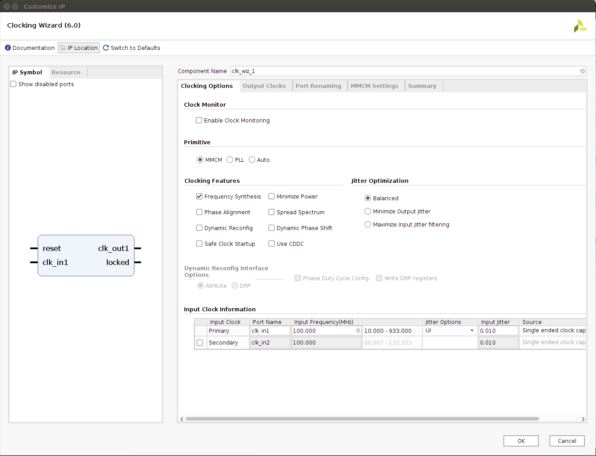

When you click on it, you will see that it wants to put it in the project:

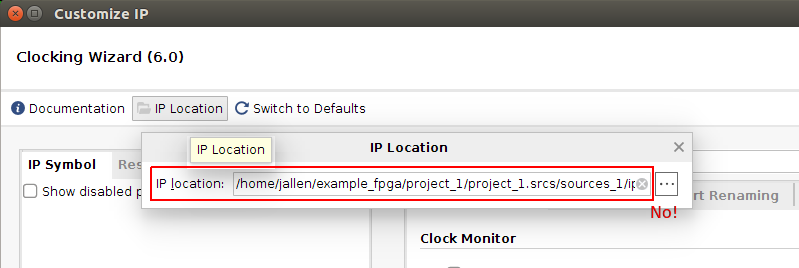

Instead put it in the ip/ directory.

You need to generete the output products, even though they do not have
to be saved in git.  When you generate them here, then Vivada knows to
regenerate them when you rebuild the project.

Just the .xci file needs to be saved in source control, but it's a good idea
to run the write_project_tcl command and check the comments to be sure.

Unfortunately the output products are generated in the same tree as the .xci
files, so you have to pay close attention to the ip/ directory.

# IP Integrator / Block design

Block designs must also be created outside of the project directory (for
example, in our ip/ directory).  This is odd, because the contents of the
block design end up in the project tcl script produced by write_project_tcl. 
The problem is that the HDL wrapper file is not produced by the project tcl,
but must exist for this script to work without failing.

When block designs are produced in ip/, many files are generated, but only
the wrapper file has to be checked into the source control.  This file is
in the list in the comments of the project tcl script:

    # 3. The following remote source files that were added to the original project:-
    #
    #    "/home/jallen/tryit/ip/design_1/hdl/design_1_wrapper.v"
    #    "/home/jallen/tryit/cons/mycons.xdc"

Anyway, when you create a block design, the default is for it to be produced
inside the project:

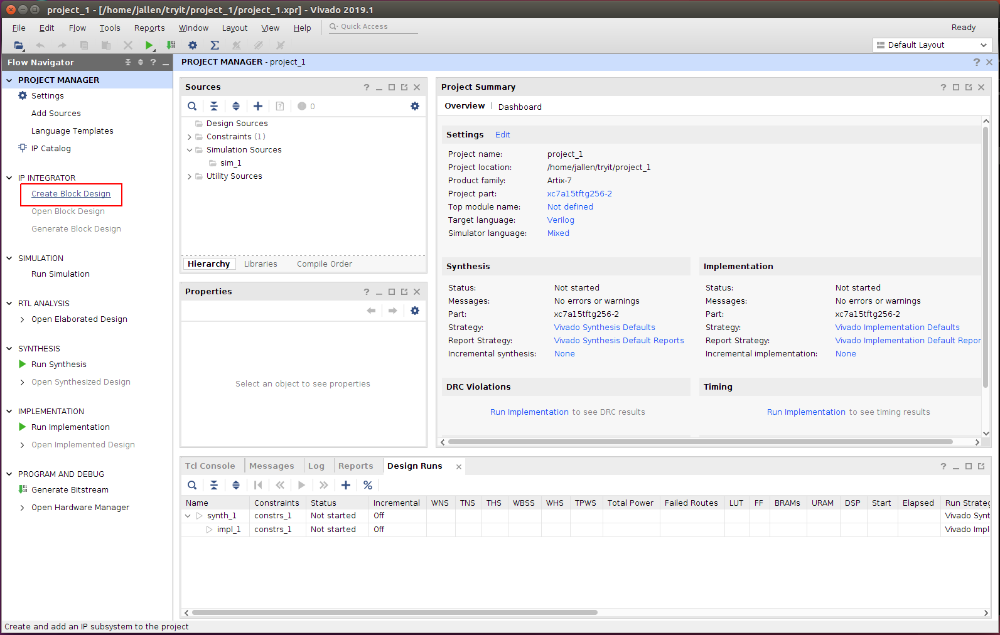

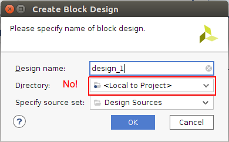

Change this to ip/:

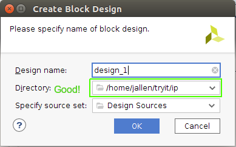

Now we create the block design:

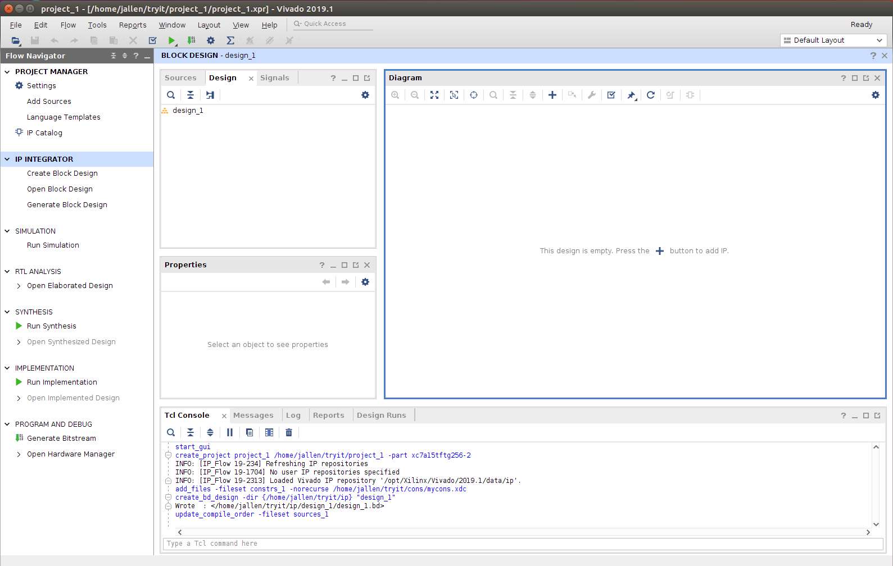

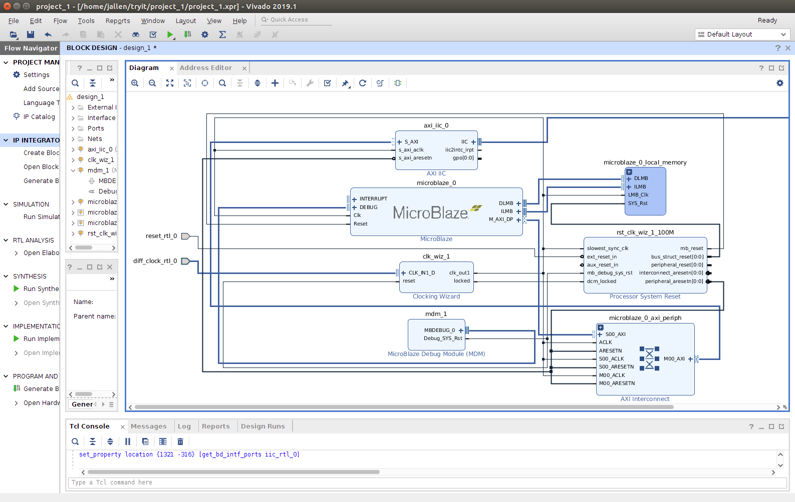

Right click on the block design and create the HDL wrapper:

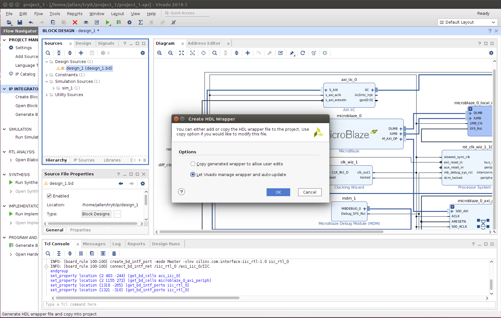

