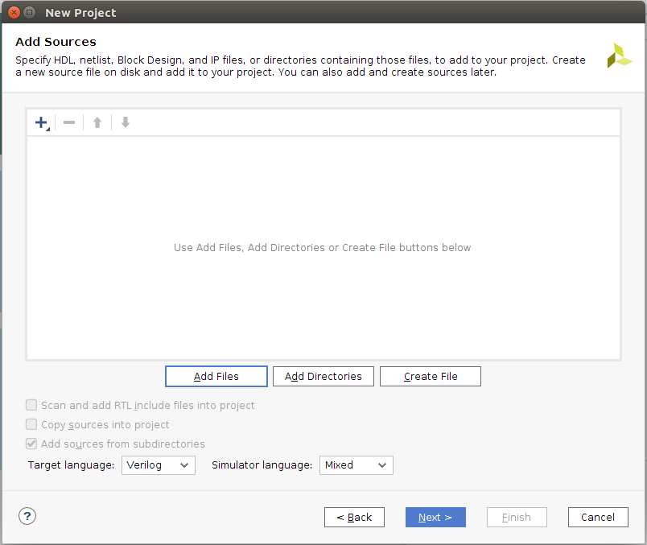
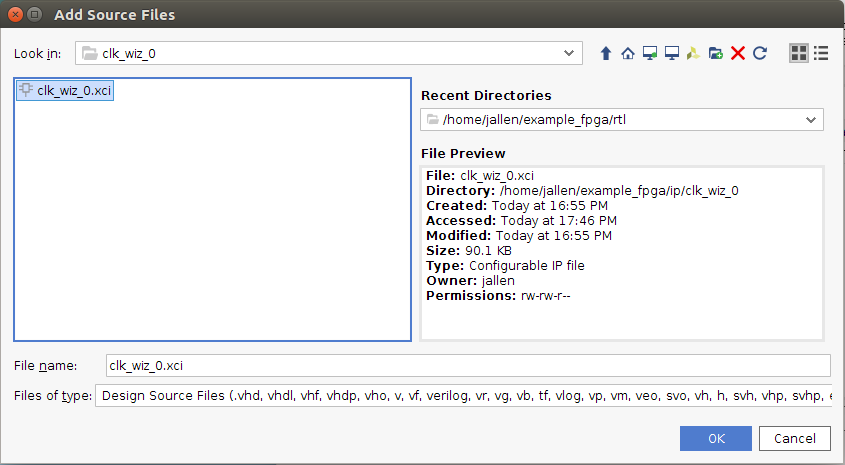
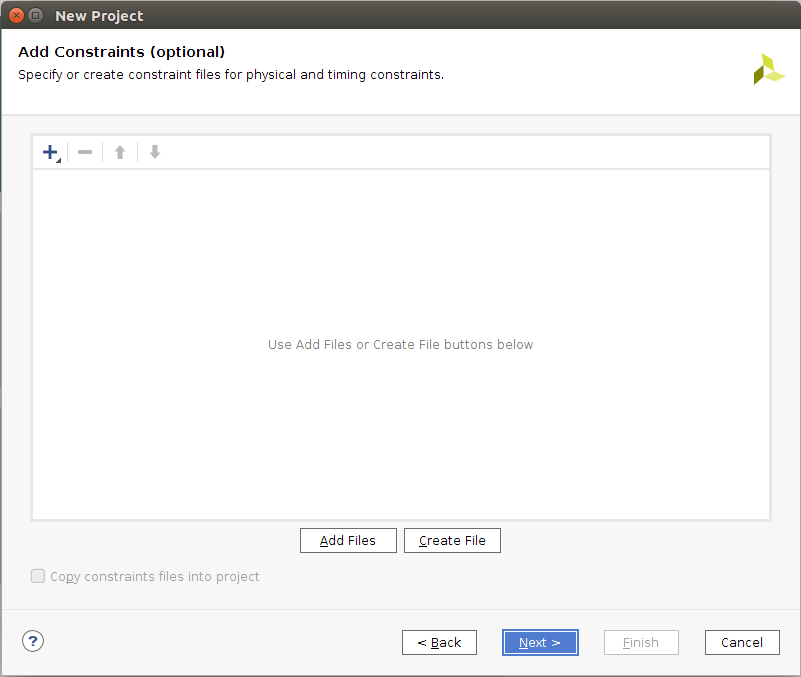
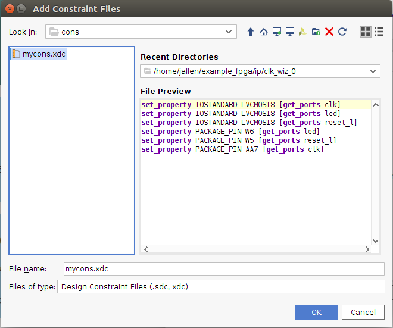
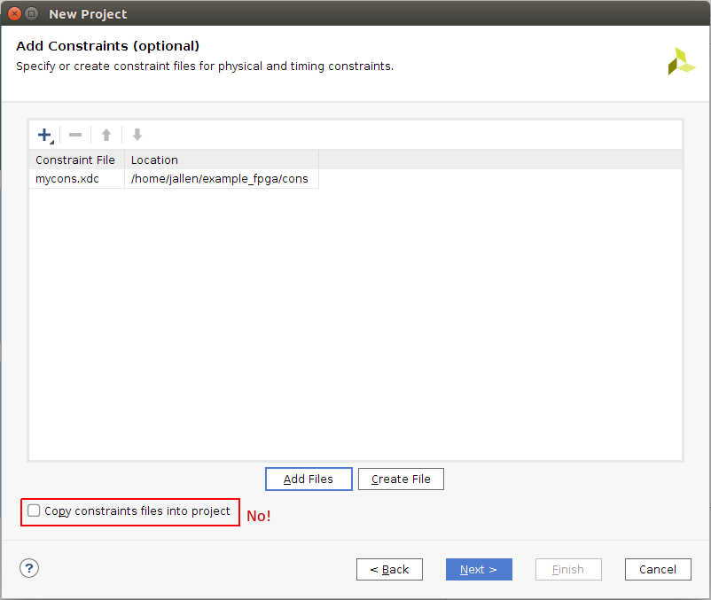
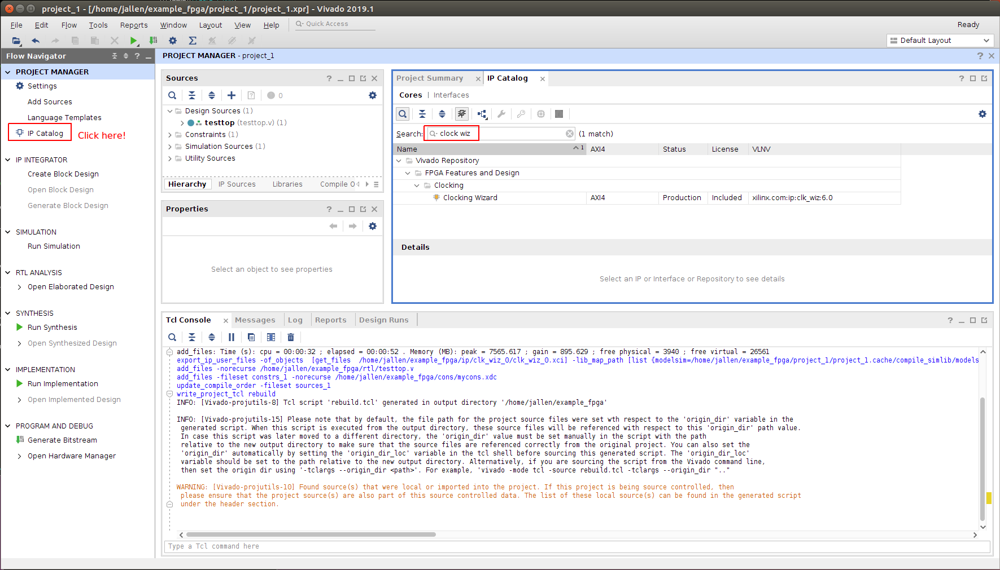
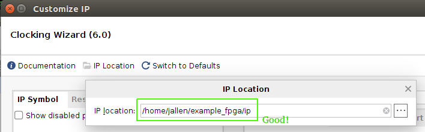
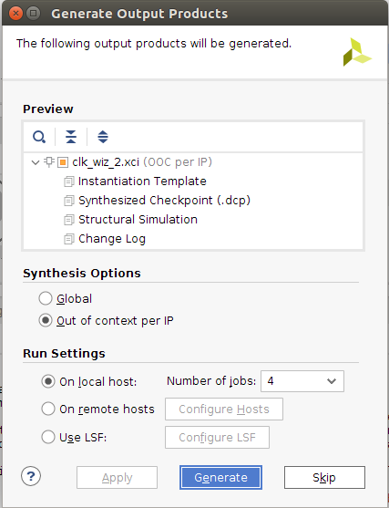

# Dealing with Xilinx Vivado

Here is one way to structure your FPGA project so that it is compatible with
both Xilinx Vivado GUI in project mode and version control.

The directory structure should be this:

    example_fpga/
        rebuild.tcl   <- TCL script created by Vivado.  Checked in.
        rtl/          <- Your Verilog (or VHDL) source code.  All checked in.
        cons/         <- Your constraint files.  All checked in.
        project_1/    <- Vivado project.  Nothing here is checked in.
        ip/           <- Xilinx IP.  Only the .xci files are checked in.

The idea is to have the minimal set of files checked in so that you get the
Vivado project back after a fresh clone.  You should only have to type these
commands:

    git clone https://github.com/jhallen/example_fpga.git
    cd example_fpga
    vivado -source rebuild.tcl &

You can always delete project_1/ and rebuild it:

    rm -rf project_1
    vivado -source rebuild.tcl &

Unfortunately, Vivado really would like your source code to be in the
project directory, so you have to actively fight it to prevent this.

# Initial project build

Suppose you don't have the project_1/ and rebuild.tcl script.  This is how
to create them.

Start vivado.  Change directory to example_fpga first. [There are other
possibilities here, but this will get you started.]

    cd example_fpga
    vivado &

Go through the usual sequence of creating a project, but not check any of
the boxes that say "copy into project":

Do not check the box here:

Don't check it here either!

Then we wait a long time, why is Vivado so slow?

Now finally the project appears:

# Save the script

Use the write_project_tcl command to save the script:

That's it.  Now you can regerenate the project with:

    rm -rf project_1
    vivado -source rebuild.tcl &

Note that the rebuild.tcl script shows you the files that need to be saved
in source control:

    # 3. The following remote source files that were added to the original project:-
    #
    #    "/home/jallen/example_fpga/ip/clk_wiz_0/clk_wiz_0.xci"
    #    "/home/jallen/example_fpga/rtl/testtop.v"
    #    "/home/jallen/example_fpga/cons/mycons.xdc"

You will have big problems if any of these are in the project directory
(example_fpga/project_1 in this case).

It does not work to delete the project_1/ directory, and sneakily write the
files back.  First the rebuild.tcl script will fail in the line with
create_project because the directory already exists.  You can try to get
around this by adding -force the line with create_project.  Unfortunately,
create_project -force deletes the entire directory, so then Vivado will
complain that the files are missing.  Also, you will be rebuilding
rebuilt.tcl many times, so you don't want to edit it.

You really need to create the source files outside of the project in the
first place.

# Xilinx IP

The next difficulty is that Xilinx IP from the "IP Catalog" is written by
default to the project directory.

An example is the clock wizard IP to use the PLL or MMCM.

