# Math Quiz / Computer Algebra System for X

This program gives a math quiz, but includes a computer algebra system.  It
was written in 1990.  I recently cleaned up the code so that it would
compile on Ubuntu.  This included fixing many warning, remove assumption
that the system is 32-bits and re-indenting the code (22 year old me was
happy with single space per-level indentation, but 50 year old me does not
like it).

This was work for my [IQP at WPI](https://www.wpi.edu/academics/undergraduate/interactive-qualifying-project). 
The IQP is supposed to be a project outside your major- well I was an EE
major and this was a CS / Math project, but still kind of close...  This was
a two person project: I wrote the code and my partner wrote the thesis.

The advisor's original idea was to use
[Prolog](https://en.wikipedia.org/wiki/Prolog) and to try to symbolically
prove that any variation of the answer that the student might enter matched
the correct answer.  But I did not think Prolog was appropriate for the mundane
tasks of an X Windowing system program, so I ended up writing it in C.  LISP
would have been a better choice, but I don't think LISP's integration with X
was so great at that time, and in any case I knew C and did not know LISP.

At the time I was fascinated by
[Macsyma](https://en.wikipedia.org/wiki/Macsyma) and wanted to learn how to
make one.

The code was originally developed on a MIPS [DECStation 3100](https://en.wikipedia.org/wiki/DECstation).

## Features

* As you type the answer in standard FORTRAN formula notation, it is typeset in standard math notation on the screen.

* An equation editor is provided which allows you to select parts of the equation with the mouse, and perform common operations on them such as simplification, factoring and distributing.

* The simplifier will combine terms, reduce fractions, take derivatives, and remove identity elements.

* You can graph the equation you are working on at the click of a button.

## Build Instructions

For Ubuntu 16.04:

	apt-get install xorg-dev

	make

## How to use it

Start the problem like this:

	./quiz data

Data is contains the quiz.

You will see this opening screen:

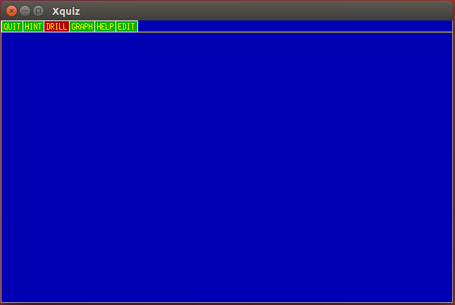

To start the quiz, select DRILL and pick one of the question sets (the
example data file has just one, "Main section"):

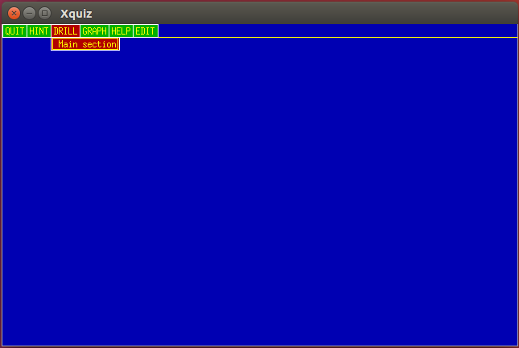

The program will ask you to enter the answer to the presented math question:

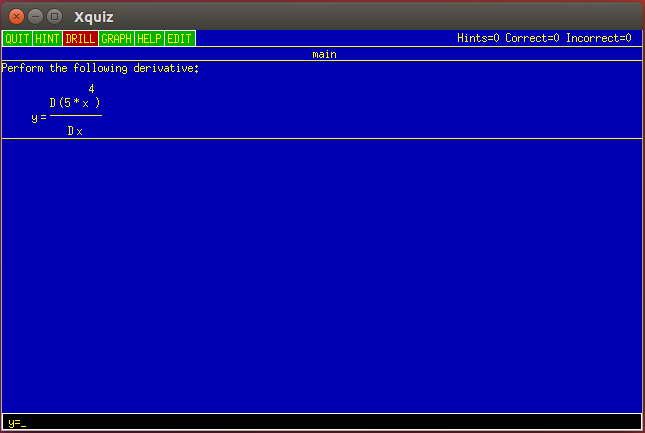

As you type in the answer, it is typeset.  Note that "?" is placed where the
next term should go:

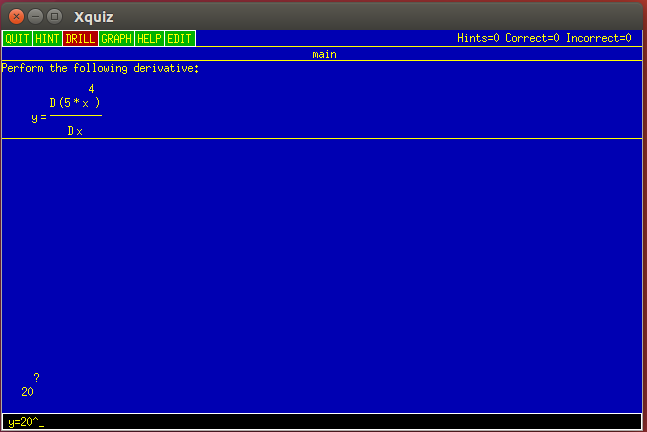

When you hit Enter, it checks the result.  A wrong answer looks like this:

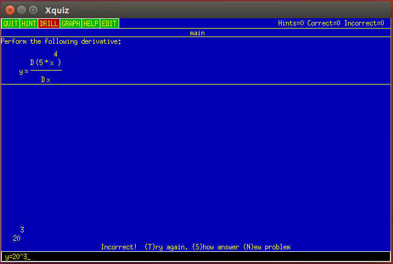

A correct answer looks like this:

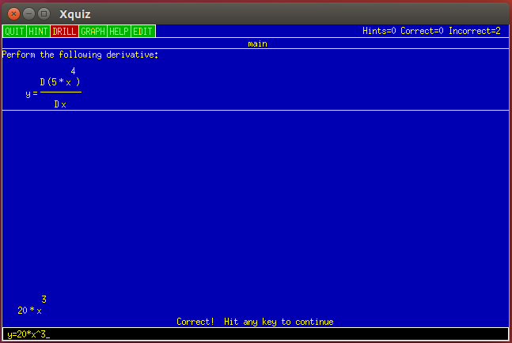

## Equation editor

Click on Edit to bring up the equation editor:

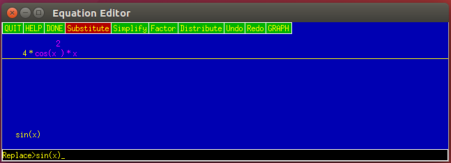

The default action is substitute, which means the selected part of the
equation is replaced by what is entered at the prompt:

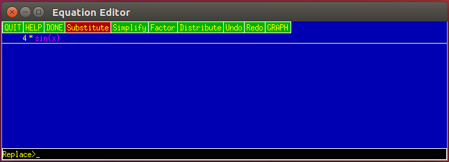

If no part of the equation is selected, then the entire equation is
replaced.

You can click on Undo and Redo to cycle through past versions of the
equation as you edit it.

The equation editor knows how to factor quadractic equations.  First enter
one:

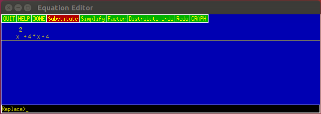

Then click on factor:

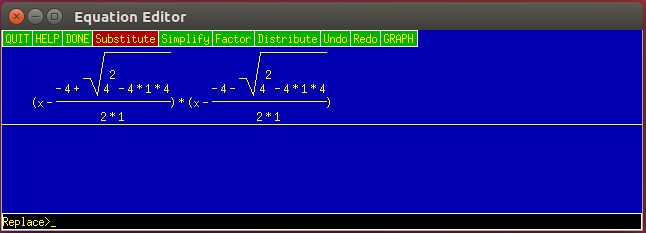

Next click simplify:

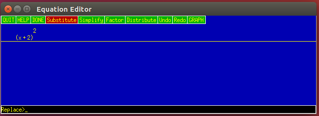

Or, go back to the raw factoring:

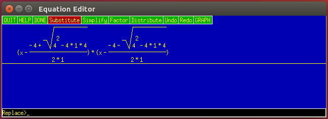

And click on Distribute:

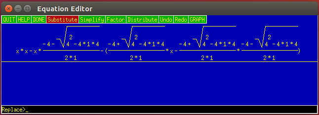

Then simplify:

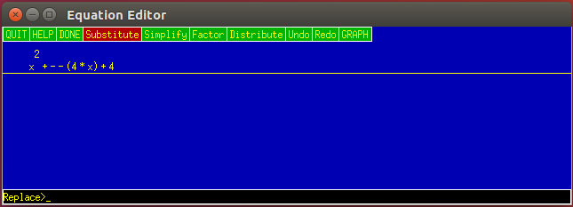

Again:

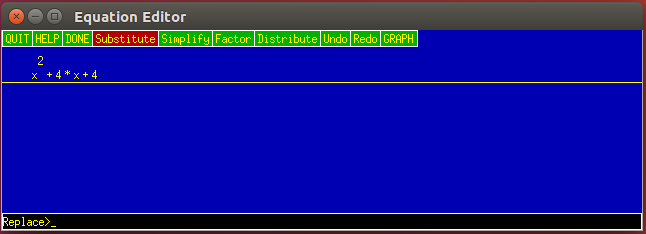

And we get the original equation back.

Click Graph to graph it:

Use the left and middle mouse buttons to zoom in or out.

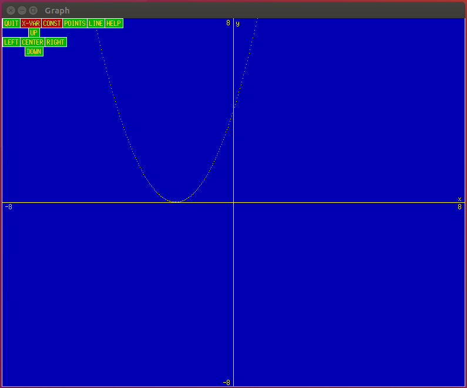

Click Line to connect the dots:

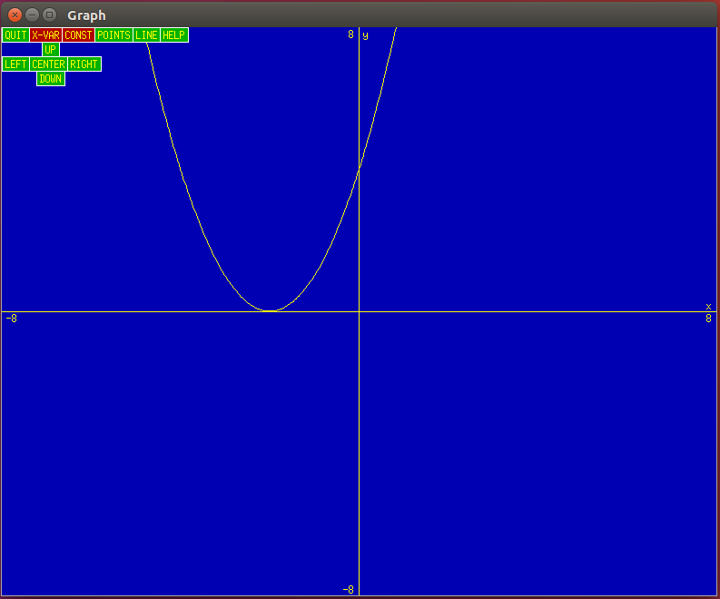

It can simplify fractions:

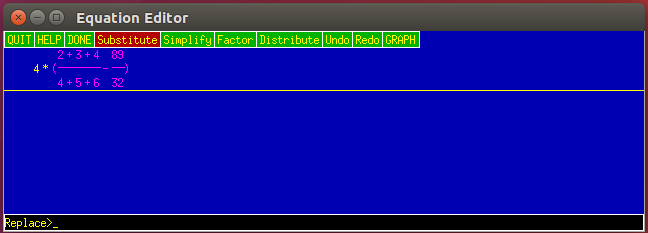

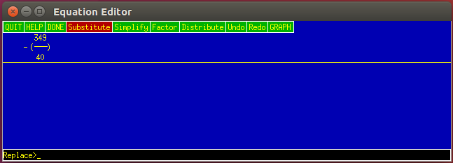

It can take derivatives.  Enter them like this:

Then simplify:

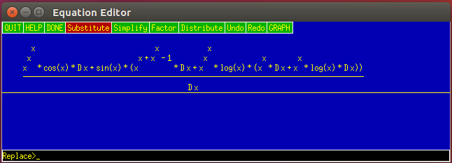

And simplify some more:

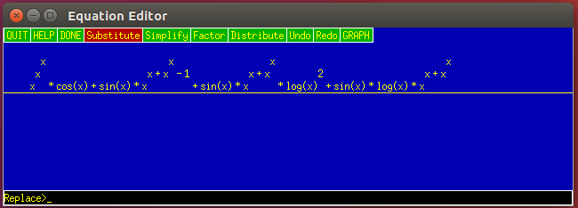

Wolfram Alpha provides the same answer:

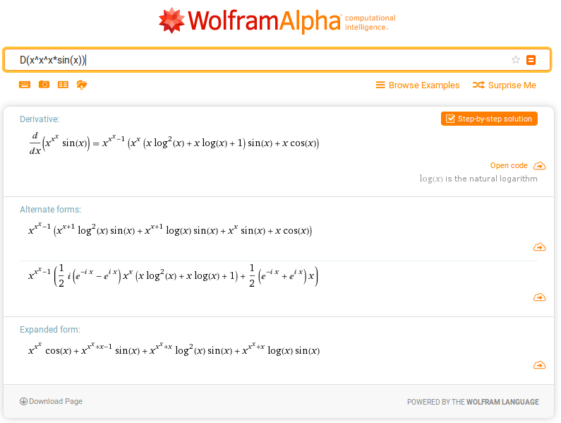

## The code

The scan.c and parse.c parse entered equations into a LISP-like list.

box.c defines these lists.  Lists are made up of list nodes, numbers or
symbols.  Each of these are allocated out of a page.  The header of the page
determines the type of the item (list node, number or symbol).  Some classic
LISP systems used this technique.

There is no garbage collection, but there should be.  Lists can be directly
freed.

Sym.c has symbol lookup functions and builtin.c has known initial symbols. 
Symbols can be bound to values for the purpose of evaluation (for example
when graphing).

Button.c, display.c, main.c, msg.c, pulldown.c and xjunk.c provide a tiny X
widget library (only Xlib is required to build the program).  Main.c has X
event handler.  dspfind() is a key function: it locates the widget structure
based on the Window number returned in the X event.  Once this is located,
the event is delivered to a member function of the widget.

Unparse.c typesets equations.  It also can find the source list node based
on the mouse coordinate.  This how you can select a part of the equation
with the mouse.

Simplify.c has code for simplification (including differentiation),
factoring and distributing.
